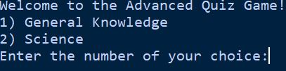

# Advanced Quiz Game

Welcome to the Advanced Quiz Game! This README provides instructions on how to use the quiz program, including setup, gameplay, and features.
The Advanced Quiz Game is a Python-based quiz application that challenges players with questions across multiple categories and difficulty levels. The game dynamically adjusts question difficulty based on the player's performance and offers lifelines to assist with tough questions.

## How to run
- download the repo files
- open the quiz_game.py file in an editor
- run the file

